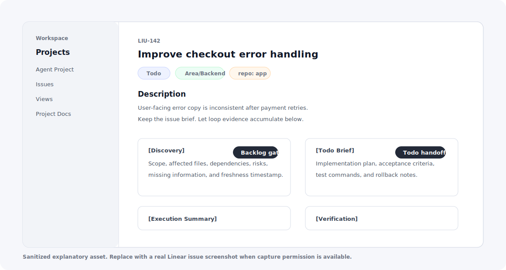
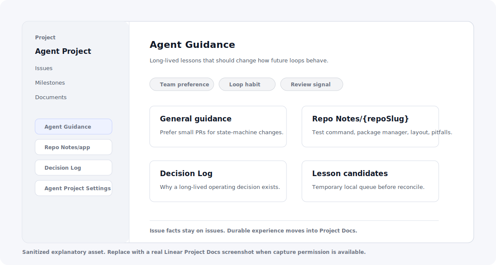

# Looplane

Chinese docs: [README.zh-CN.md](README.zh-CN.md)

A Linear-centered loop system for local agents. Looplane keeps the prompt files,
operating docs, and examples; Linear remains the operating surface.

This is closer to current loop engineering than traditional prompt engineering. The
work is not one clever prompt. The work is making state, evidence, memory,
transitions, conflicts, and scheduled execution form a durable loop.


## Start Here

- [Local setup](INSTALL.zh-CN.md) - three-step startup guide.
- [Prompts](prompts/) - one-time setup prompt and scheduled loop prompts.
- [Operating notes](docs/usage.md) - state, handoff, memory, and exception rules.

The files under `prompts/` are the prompts to copy into the agent runtime. Each loop
prompt includes its role, local directory conventions, handoff rules, Markdown run
note convention, and runtime issue log format.

## What It Solves

A single agent can easily mix up what to do now, what it learned before, who may
change code, and whether a state transition is still valid. This system separates
those concerns:

- Linear issues hold issue-bound facts, evidence, and execution records.
- Linear Project Docs hold long-lived experience and project preferences.
- `~/.linear-loop` holds minimal runtime state, locks, cooldowns, and local
  repo/worktree cache.
- Schedules only start the matching loop.
- Coordinator handles conflicts, unknown states, stale runs, lock problems, and
  multi-repo coordination.

## Three-Step Setup

1. Initialize Local Loop Space:

   ```sh
   mkdir -p ~/.linear-loop/state/{issues,locks,cooldowns}
   mkdir -p ~/.linear-loop/runtime-issues
   mkdir -p ~/.linear-loop/{repos,worktrees}
   touch ~/.linear-loop/state/lesson-candidates.jsonl
   ```

2. Put prompt files from [prompts/](prompts/) into the matching runtime entry: run
   `prompts/initial-setup.md` manually once, then paste the other loop prompts into
   AG platform schedules.

3. Run `prompts/initial-setup.md` manually. It checks the local directory, Linear
   workflow states, labels, Project `Agent Project Settings`, and Project Docs, then
   prints the schedules that still need to be created.

See [INSTALL.zh-CN.md](INSTALL.zh-CN.md) for the full setup.

## What Linear Stores



The issue is the source of truth for issue-bound facts. Discovery writes
`[Discovery]`; Todo writes `[Todo Brief]`; execution summaries, verification results,
and blockers stay on the same issue.



Project Docs are the long-term memory layer:

- `Agent Guidance`: general operating lessons and team preferences.
- `Repo Notes/{repoSlug}`: repo-level test commands, structure, and pitfalls.
- `Decision Log`: long-lived decisions.

The images above are sanitized explanatory assets. Real Linear screenshots can replace
the same files under `docs/assets/` without changing the README structure.

## Loop Shape

```text
Triage
  -> Backlog
      -> Discovery writes [Discovery]
      -> Todo writes [Todo Brief]
      -> In Progress asks Repo Manager for code lock
      -> In Review
      -> Done

Canceled / Duplicate
  -> close or archive with evidence

Memory/Reconcile
  -> merge repeated lessons into Project Docs

Coordinator
  -> resolve conflicts, stale runs, unknown states, lock problems
```

Each state loop scans only the Linear state it owns. It reads Linear, GitHub, the local
filesystem, and `~/.linear-loop`; re-reads before writing; checks for conflicts; and
writes only the results it is allowed to apply.

## Local Loop Space

Default runtime directory:

```text
~/.linear-loop/config.yaml
~/.linear-loop/state/issues/
~/.linear-loop/state/locks/
~/.linear-loop/state/cooldowns/
~/.linear-loop/state/lesson-candidates.jsonl
~/.linear-loop/runtime-issues/YYYY-MM.jsonl
~/.linear-loop/repos/
~/.linear-loop/worktrees/
```

Local Loop Space stores runtime control state, locks, cooldowns, runtime issues, and
repo/worktree cache. It is not the default store for Discovery reports, Todo briefs,
or full run JSON history.

Repository origins, default branches, and verification commands belong in Linear
Project `Agent Project Settings`. The local directory does not replace project
settings or a repo registry.

## Write Rule

Each state loop must:

1. Scan only the Linear state it owns.
2. Claim an issue and record the observed Linear and `~/.linear-loop/state` snapshot.
3. Perform its own allowed Linear, GitHub, filesystem, and local state changes.
4. Re-read Linear and local state before writing.
5. Apply only if state, `updatedAt`, fingerprint, active run, and lease or lock data
   still match.
6. Escalate to Coordinator when the snapshot is stale.
7. Write durable facts to Linear, GitHub, Project Docs, or `~/.linear-loop`; if a
   final summary is useful, make it a short Markdown `Run Note`.

## Prompt Files

- [prompts/initial-setup.md](prompts/initial-setup.md) runs once to prepare Linear,
  Project Docs, and `~/.linear-loop`.
- The `*-loop.md` files are scheduled state or service loops.
- [prompts/repo-manager.md](prompts/repo-manager.md) owns clone, fetch, worktree, and
  repo lock operations.

Edit the prompt files directly. There is no generation step.

## Do Not

- Do not let every loop scan every issue.
- Do not let a state loop write after its observed snapshot is stale.
- Do not let code-backed work enter `Todo` without a fresh `[Discovery]` block.
- Do not let In Progress modify code without a Repo Manager write lock.
- Do not use Coordinator for routine state movement.
- Do not hide issue-bound evidence in `~/.linear-loop` as long-term truth.
- Do not hide prompt, access, Linear setup, or local storage problems in comments
  only; append runtime issue records to
  `~/.linear-loop/runtime-issues/YYYY-MM.jsonl`.
