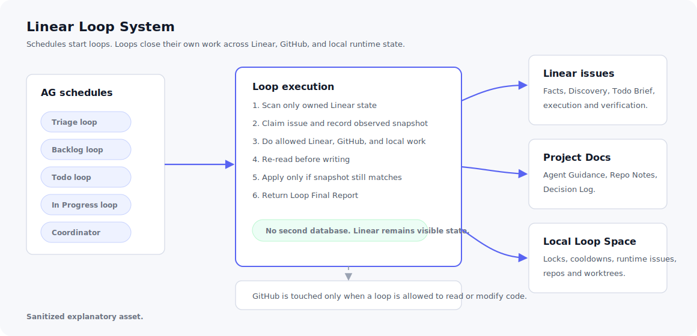

# Linear Loop System

把 Linear issue 交给一组本地 agent loop 持续处理。这个仓库维护 loop 的契约、
standalone prompts、schema 和验证脚本；真正的运行界面仍然是 Linear。

它更接近最近很火的 loop 工程，而不是传统 prompt 工程。重点不是写一段漂亮
prompt，而是把状态、证据、记忆、迁移、冲突处理和周期性执行组织成能长期运转的
闭环。



## 先从这里开始

- [本地安装](INSTALL.zh-CN.md)：三步启动。
- [复制包](dist/zh-CN/prompts/)：粘贴到 AG 平台 schedule 的 prompts。
- [使用细则](docs/usage.zh-CN.md)：状态、handoff、记忆和异常处理规则。

不要把 `prompts/` 下的源码 prompt 直接粘到 schedule。用户复制的是
`dist/zh-CN/prompts/*.standalone.md`，里面已经嵌入共享契约、目录约定和
Loop Final Report 结构。

## 它解决什么

单个 agent 很容易把“现在该做什么”“之前学到了什么”“谁可以改代码”“状态能不能迁移”
混在一起。这个系统把它们拆开：

- Linear issue 保存单个任务的事实、证据和执行记录。
- Linear Project Docs 保存长期经验和项目偏好。
- `~/.linear-loop` 保存最小运行态、锁、冷却和本地 repo/worktree 缓存。
- schedule 只负责定时启动对应 loop。
- Coordinator 只处理冲突、未知状态、过期 run、锁问题和 multi-repo 协调。

## 三步启动

1. 初始化本地 Loop Space：

   ```sh
   mkdir -p ~/.linear-loop/state/{issues,locks,cooldowns}
   mkdir -p ~/.linear-loop/runtime-issues
   mkdir -p ~/.linear-loop/{repos,worktrees}
   touch ~/.linear-loop/state/lesson-candidates.jsonl
   ```

2. 把 [dist/zh-CN/prompts/](dist/zh-CN/prompts/) 里的 standalone prompt 粘到
   AG 平台对应 schedule。

3. 手动运行 `initial-loop.standalone.md`。它会检查本地目录、Linear workflow
   states、labels、Project `Agent Project Settings` 和 Project Docs，并告诉你
   还需要创建哪些 schedules。

完整步骤见 [INSTALL.zh-CN.md](INSTALL.zh-CN.md)。


## loop 怎么协作

```text
Triage
  -> Backlog
      -> Discovery writes [Discovery]
      -> Todo writes [Todo Brief]
      -> In Progress asks Repo Manager for code lock
      -> In Review
      -> Done

Canceled / Duplicate
  -> close or archive with evidence

Memory/Reconcile
  -> merge repeated lessons into Project Docs

Coordinator
  -> resolve conflicts, stale runs, unknown states, lock problems
```

每个状态 loop 只扫描自己负责的 Linear 状态。它自己读 Linear、GitHub、本地文件和
`~/.linear-loop`，自己做写前重读和冲突判断，自己写回允许的结果。

## 本地 Loop Space

默认目录固定为：

```text
~/.linear-loop/config.yaml
~/.linear-loop/state/issues/
~/.linear-loop/state/locks/
~/.linear-loop/state/cooldowns/
~/.linear-loop/state/lesson-candidates.jsonl
~/.linear-loop/runtime-issues/YYYY-MM.jsonl
~/.linear-loop/repos/
~/.linear-loop/worktrees/
```

本地目录只保存运行控制状态、锁、冷却、runtime issues 和 repo/worktree 缓存。
不要把 Discovery report、Todo brief 或完整 run JSON 历史默认存到本地。

repo origin、default branch、验证命令写在 Linear Project 的 `Agent Project Settings`。
本地目录不重新引入 repo registry。

## 核心写入规则

每个状态 loop 都必须：

1. 只扫描自己负责的 Linear 状态。
2. claim issue，并记录当时看到的 Linear 和 `~/.linear-loop/state` 快照。
3. 执行自己允许的 Linear、GitHub、本地文件和 local state 修改。
4. 写入前重新读取 Linear 和本地 state。
5. 只有 state、`updatedAt`、fingerprint、active run、lease/lock 都匹配时才写。
6. 不匹配就不要写，交给 Coordinator。
7. 最后输出 Loop Final Report，作为日志和异常归并依据，不作为第二套数据库。

## 维护者入口

- [prompts/](prompts/)：模块化源码 prompt。
- [schemas/loop-result.schema.json](schemas/loop-result.schema.json)：Loop Final Report
  结构。
- [scripts/build-standalone-prompts.py](scripts/build-standalone-prompts.py)：生成复制包。
- [scripts/validate-copy-pack.py](scripts/validate-copy-pack.py)：检查复制包。
- [scripts/validate-loop-schema.py](scripts/validate-loop-schema.py)：检查 schema 和 fixtures。

修改 prompt 后运行：

```sh
python3 scripts/build-standalone-prompts.py
python3 scripts/build-standalone-prompts.py --check
python3 scripts/validate-copy-pack.py
python3 scripts/validate-loop-schema.py
```

## 不要这样做

- 不要让所有 loop 扫所有 issue。
- 不要让状态 loop 在快照过期后继续写 Linear。
- 不要让代码类 issue 在没有 `[Discovery]` 时进入 `Todo`。
- 不要让 In Progress 在没有 Repo Manager write lock 时改代码。
- 不要让 Coordinator 负责日常状态推进。
- 不要把业务证据藏进 `~/.linear-loop` 当长期事实库。
- 不要把 prompt、schema、权限、Linear 设置或本地目录问题只写在评论里；写入
  `runtimeIssues[]` 并追加到 `~/.linear-loop/runtime-issues/YYYY-MM.jsonl`。
